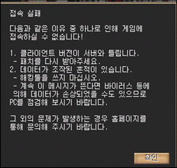
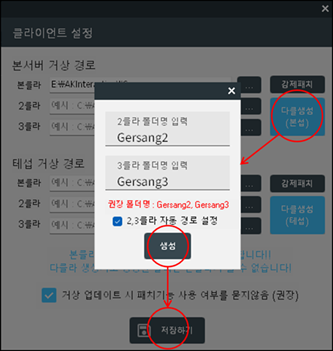
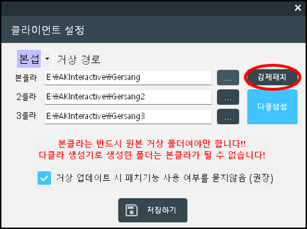
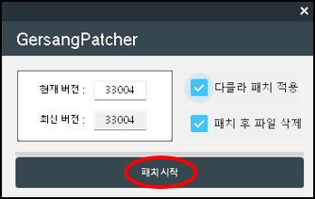

다클라 생성 기능을 사용하여 클라를 다시 생성 해주세요.

 

이전에 복사-붙여넣기로 클라이언트를 생성 하셨다면 거상 스테이션에서 패치가 정상적으로 되지 않습니다. 
만약 이미 거상 스테이션으로 클라 생성을 하셨는데도 되지 않는다면 최하단을 참고 해주세요.

1. **기존에 복사-붙여넣기로 생성한 클라이언트를 삭제 해주세요. (본클 제외)** 
2. 클라이언트 설정 - 다클라 생성 기능을 통해 클라이언트를 생성 해주세요. 
3. 다클라 경로는 자동 지정 됩니다. 저장 하신 뒤 게임을 실행 해보세요. 

 

만약 거상 스테이션으로 생성 하셨는데도 동일한 증상이 발생하시나요? (패치 직후) 
그러면 아래와 같이 강제 패치를 한 번 해보세요. 원인은 현재 조사 중에 있습니다. 

 
 

여전히 오류가 발생한다면 1:1문의 이용해주세요.