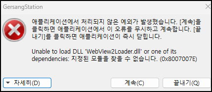

실행 파일을 바탕화면에 바로 옮기시면 안됩니다.

1. GersangStation.exe 파일을 원래 위치로 되돌려놓으세요 (또는 재설치)
2. GersangStation.exe 파일을 더블클릭 하셔서 그냥 실행 하세요.

3. 바탕화면에 바로가기를 생성할지 물어봅니다. "예"를 누르세요.

(파일을 우클릭 하신 뒤 "바로 가기 만들기" 하셔서 나온 파일을 바탕화면에 두셔도 똑같습니다.)