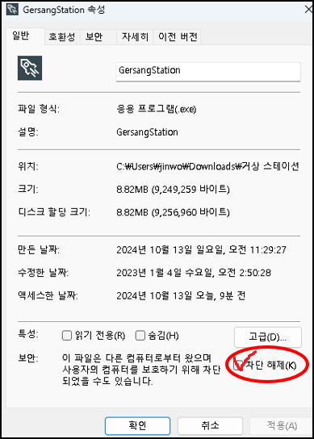
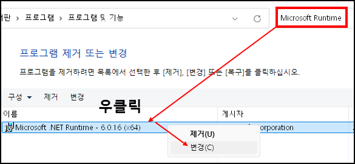
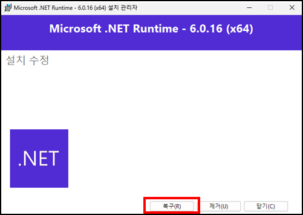
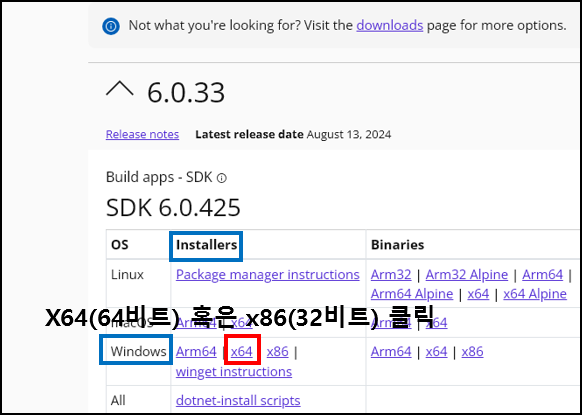
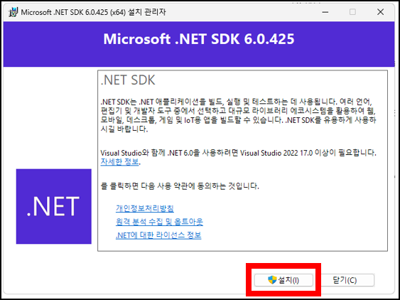
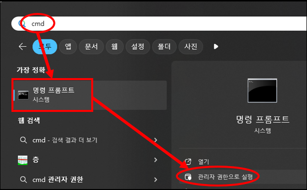
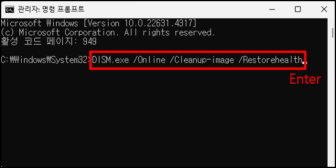

아래 방법을 차례대로 시도 해보세요.

해결에 앞서 각종 보안 프로그램 (V3, 알약, 노턴 등)이 차단하고 있지 않은지 직접 확인 부탁 드립니다. 
만약, 차단하고 있다면 예외 설정을 해 주시기 바랍니다. (스테이션 패치 때마다 발생할 수 있음..) 

아래 방법을 하나씩 시도 해보시고 안되면 다음 해결 방법을 시도 해보세요. 

1. GersangStation.exe 우클릭 - 속성
2. 위 사진과 같이 "차단 해제" 체크박스에 체크 하기 -> 적용 -> 확인
3. 거상 스테이션 재실행
4. 위 이미지와 같이 체크 박스가 아예 없거나 실행되지 않으면 아래 참고

1. 제어판에서 "Microsoft Runtime" 검색 후 우클릭-변경
2. 복구 클릭
3. 거상 스테이션 재실행
4. 실행되지 않으면 아래 참고

1. [링크](https://dotnet.microsoft.com/en-us/download/dotnet/6.0) <- 클릭하여 접속 해주세요.
2. 위 사진과 같이 프로그램을 설치 해주세요.
3. 설치가 완료되면 거상 스테이션 재실행
4. 실행되지 않으면 아래 참고

1. 첫 번째 이미지와 같이 명령 프롬프트를 관리자 권한으로 실행 해주세요.
2. "DISM.exe /Online /Cleanup-image /Restorehealth" 를 쌍따옴표 제외 복사 후 우클릭 하시면 붙여넣기 됩니다.
3. 엔터를 누르시고 모든 과정이 종료되면 "sfc /scannow" 를 쌍따옴표 제외 복사 후 우클릭 하시면 붙여넣기 됩니다.
4. 모든 과정이 끝난 후 창을 닫고 거상 스테이션 재실행

제가 알려드릴 수 있는 방법은 여기까지가 끝입니다. 
모든 방법을 시도 하셨는데도 여전히 반응이 없다면 포맷을 하시는 방법 밖에 없습니다. 
따라하기 힘드시거나 궁금하신 것이 있으시면 1:1 문의 부탁 드립니다.