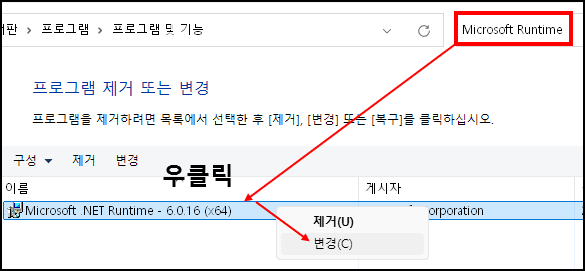
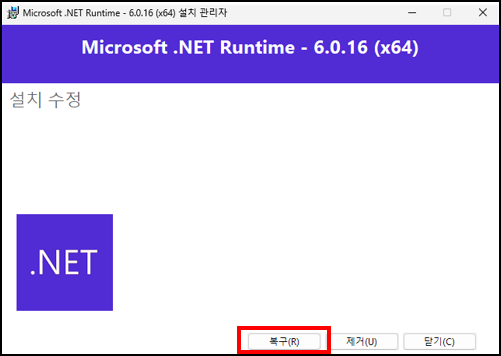
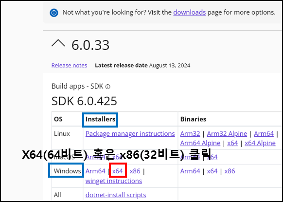
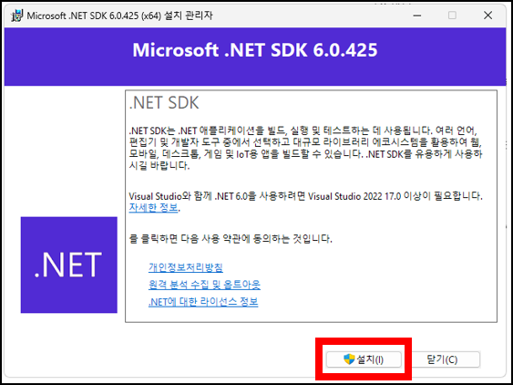

.NET Runtime을 복구 해주세요.

1. 제어판에서 "Microsoft Runtime" 검색 후 우클릭-변경
2. 복구 클릭
3. 거상 스테이션 재실행

만약, 복구를 한 후에도 여전히 반응이 없다면 아래 방법을 시도 해보세요.

1.  <- 클릭하여 접속 해주세요.
2. 위 사진과 같이 프로그램을 설치 해주세요.
3. 설치가 완료되면 거상 스테이션 재실행

모든 방법을 시도하였지만 여전히 반응이 없다면 1:1 문의 부탁 드립니다.